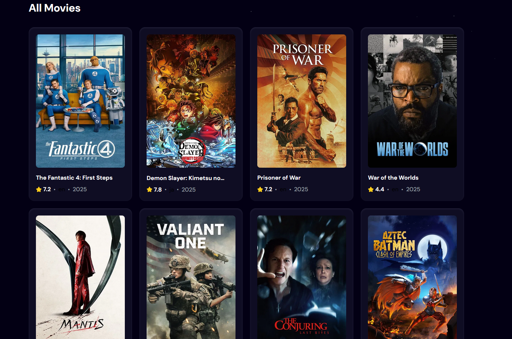

# 🎬 Movie Finder App

A React-based movie search app powered by the [TMDB API](https://www.themoviedb.org/documentation/api).  
Users can browse popular movies or search by title with debounced input for smoother performance.

---

## 🚀 Features

- 🔍 **Search Movies** — type a title and get results from TMDB.
- ⏳ **Debounced Search** — API requests only fire after the user stops typing.
- ⭐ **Movie Ratings** — displays the average rating (from `vote_average`).
- 🗓️ **Release Year** — shows the release year extracted from `release_date`.
- 🖼️ **Movie Posters** — fetches poster images, with a fallback if missing.
- 🔄 **Loading Spinner** — visual feedback while fetching data.
- ⚠️ **Error Handling** — friendly messages when something goes wrong.

---

## 🛠️ Tech Stack

- [React](https://react.dev/) (Vite setup)
- [react-use](https://github.com/streamich/react-use) for debouncing
- [Tailwind CSS](https://tailwindcss.com/) for styling
- [TMDB API](https://developer.themoviedb.org/docs)

---

## 📂 Project Structure

src/
├── components/
│ ├── MovieCard.jsx # Single movie display card
│ ├── Search.jsx # Search bar component
│ └── Spinner.jsx # Loading spinner
├── App.jsx # Main app logic
└── main.jsx # Entry point

## 🖼️ Screenshots

Here is a preview of the top banenr

Here is a preview of movie cards listed

